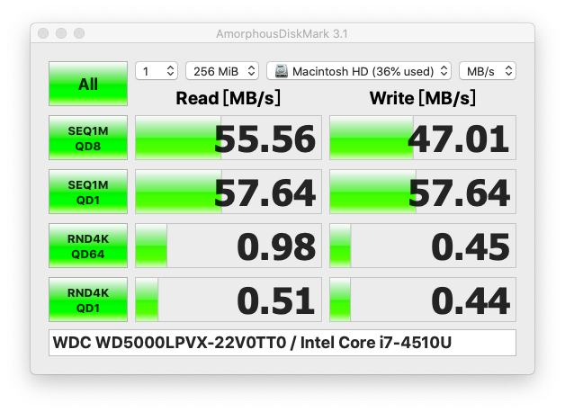

# Acer TravelMate-P645MG

|   规格   |                      详细信息                      |
| :------: | :------------------------------------------------: |
| 电脑型号 |          Acer TravelMate-P645MG                |
|  处理器  |        intel Core i7-4510U @ 2.30GHz 2core        |
|   主板   |                     宏碁 BAD40 _HW                  |
|   显卡   |               Radeon HD 8750M ( 2 GB )            |
|   内存   |               2x 4GB DDR3 1600MHz              |
|   硬盘   |              512GB  SATA 2.5寸机械          |
|  显示器  |                   友达 AUO2A3C                  |
|   声卡   |                     Unknown                    |
|   网卡   |              Intel Wireless-N 7260          |
|  读卡器  |                     Unknown                 |

## 目前状态：
* 系统：10.15.7运行正常
* 硬盘：正常

* 独立显卡：不知道咋驱动，先放着
* 集成显卡：成功
* 触摸板：玄学的成功（支持手势，最多识别3点）
* 声卡：voodooHDA，先放着
* wifi：正常
* 蓝牙：正常
* HDMI：未知
* 摄像头：正常
* 读卡器：未知
* 睡眠：未知

## 不正常的：
* `指纹`无法驱动

## TIPS  
> QQ群号865916636

### Big Sur 开启hidpi（高分辨率）

    bash -c "$(curl -fsSL https://raw.githubusercontent.com/xzhih/one-key-hidpi/dev/hidpi.sh)"

### Catalina 开启hidpi（高分辨率）

    bash -c "$(curl -fsSL https://raw.githubusercontent.com/xzhih/one-key-hidpi/master/hidpi.sh)"
    

### 更新小记 (Changelog)

## 安装方法

## 建议

## TIPS

## 如何更爽一点?

### 热补丁
| 补丁                | 说明                                            | 必备 | 建议 | 可选 |
| ------------------- | ----------------------------------------------- | ---- | ---- | ---- |

### KEXT
| KEXT                                | 说明                  | 必备 | 可选 |
| ----------------------------------- | --------------------- | ---- | ---- |

